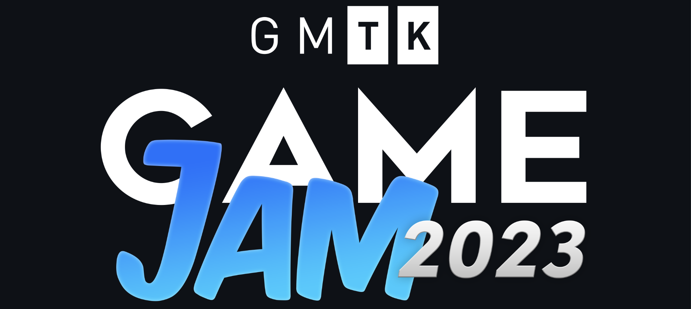
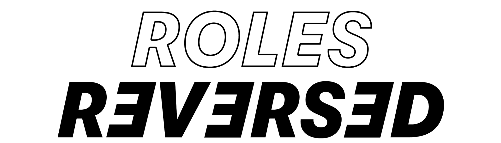
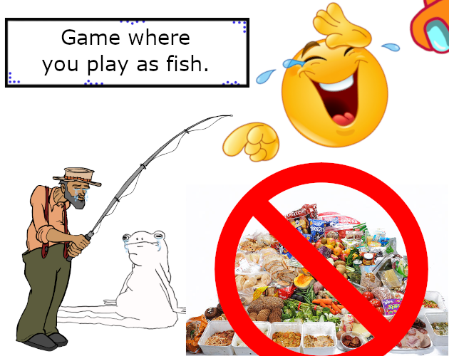
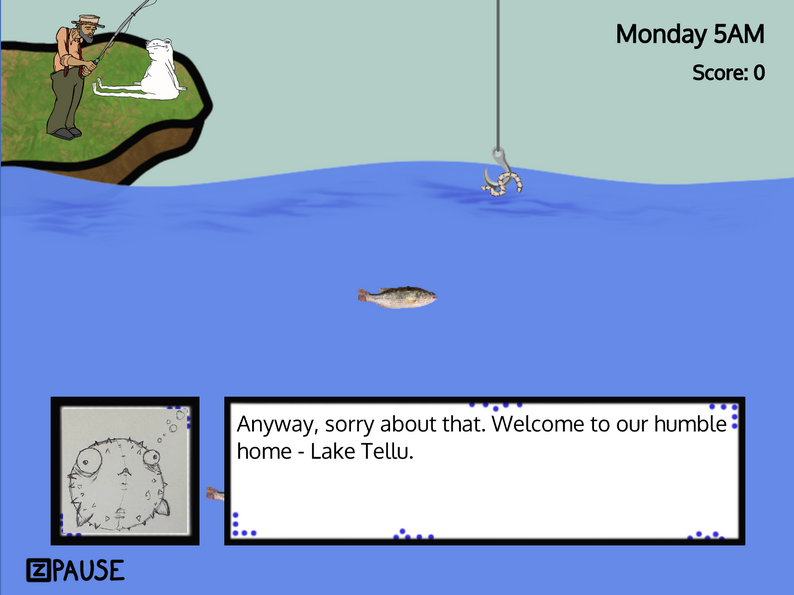
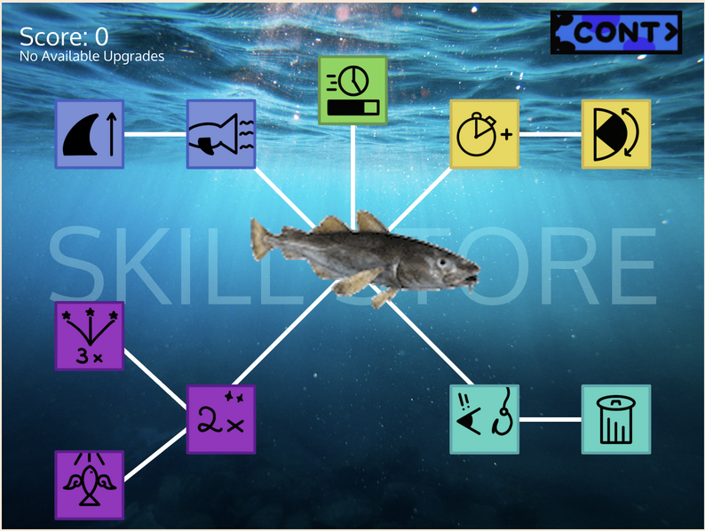
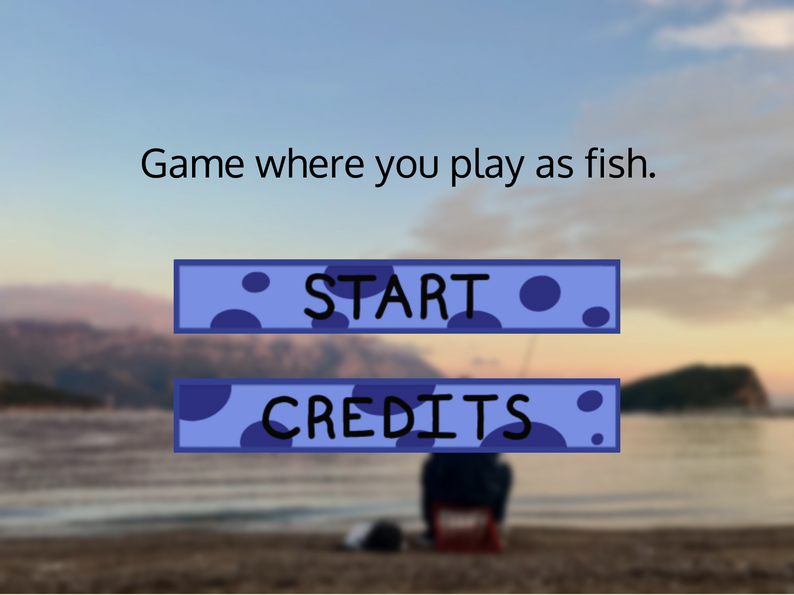

# Our GMTK 2023 Game Jam Entry

We created a fishing game where you are the fish and you are trying to steal bait from a fishing hook while simultaneously preventing your fish friends from being caught. You are then able to get upgrades to improve your fish.

## Theme

The theme was "Roles Reversed". We approached this theme by instead of making a classic fishing game where you gain points by trying to catch fish, instead you must stop the fisherman from catching anything.

## Images

|  |  |
| ------------------------------------ | ----------------------------------- |
|   |  |
